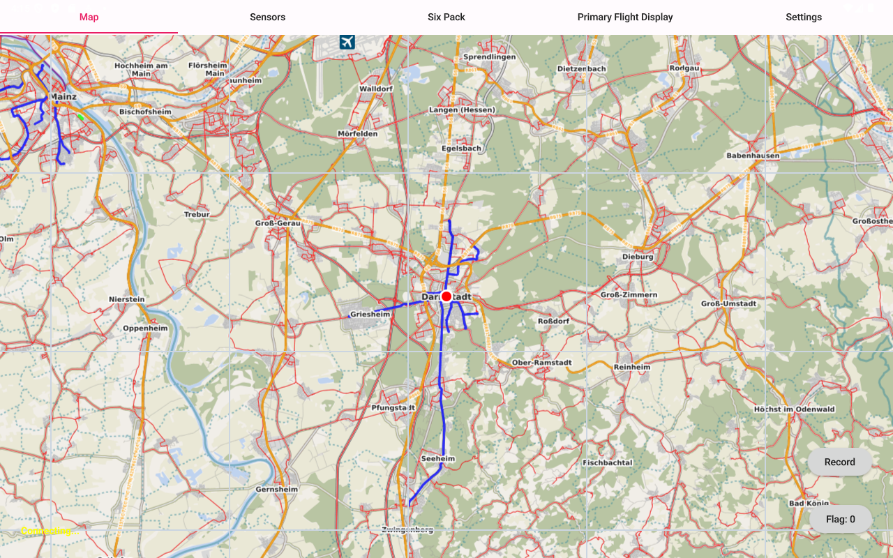
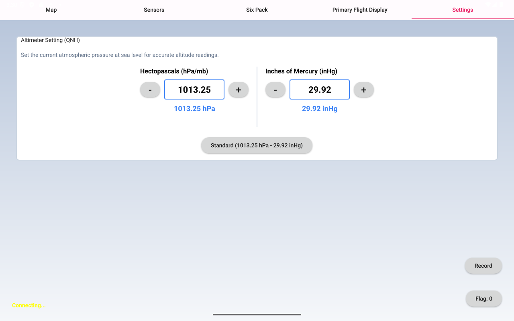

# Overview

This repository contains the codes for the application used in the Flight Mechanics Tutorial, along with all its resources and dependencies.

The main functionality of this application is to start and stop the data recording of the measurement system, as well as previewing the sensors' measurements during operation.

## Requirements

This application was developed using Qt framework, the following is the list of requirements to build and deploy this application

- Install Qt 6.
- Install all required add-ons for Android.
- Download Android Software Development Kit (SDK), as well as Java Development Kit (JDK).
- Add the path of SDK and JDK to their respective location in the Qt preferences -> SDKs.
- Qt 6 requires Android version 9 or newer, you may deploy the application to an emulator (recommended for debugging) or to an Android device with a supported Android version.

## Set up an emulator

1. Open Qt preferences -> Devices.
2. Choose Add.
3. Choose Android Device and click "Start Wizard".
4. Input a name for the emulator.
5. Choose a target API from the available ones depending on your devices processor architecture. 
6. Since the application is designed for a screen size of 10.1", Choose Tablet from the "Skin Definition" drop down menu and "10.1" from the following one.
7. Click OK, and then click OK on the Qt preferences window.

Now you will be able to see the newly created emulator in the Devices list and can be chosen as a target device to deploy the application, do not forget to choose the respective Kit to be used for deployment.

## Application components

Once the application is started, the user shall be able to see the Map tab with a marker of the current location on the map, the map tiles are to be used offline, downloaded from Mobile Atlas Creator in zoom level 11, and are embedded into the application.

On the left bottom corner, you may find the status label, once the Cockpit unit is running and the tablet is connected to the Wi-Fi network hosted by the Raspberry Pi, the status label would show Connected.

On the right bottom corner, you can see the record and flag buttons, once the record button is clicked, a dialog would pop up to confirm that you would like to start recording. The same would happen when the button is clicked to stop recording.

The Settings tab is used to input the actual barometric pressure which would be used for calculating the barometric altitude, by default it is set to the standard pressure at sea level.

The remaining tabs are for data preview during operation either numerically or visually.

## Notes

In case you would like to change the recorded topics or the name of the ROSBag, this can be edited in Main.qml by editing the variable "command".